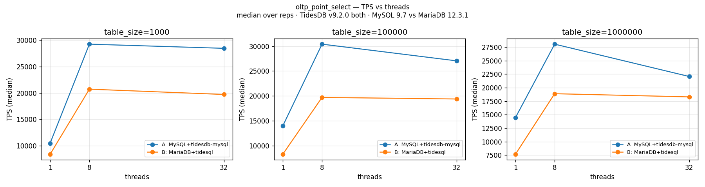
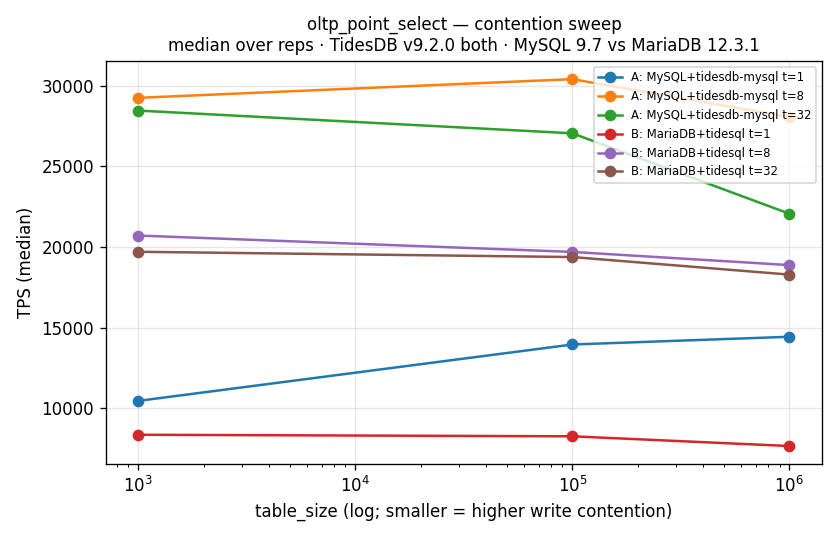
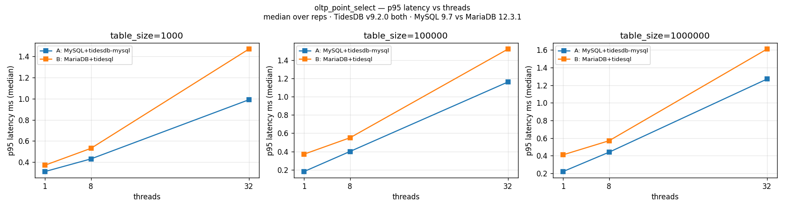
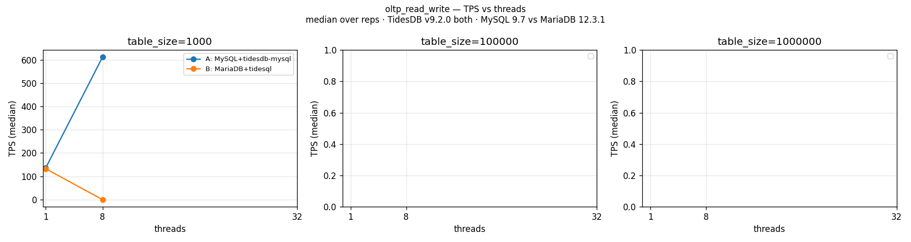
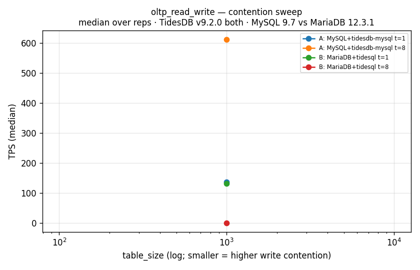
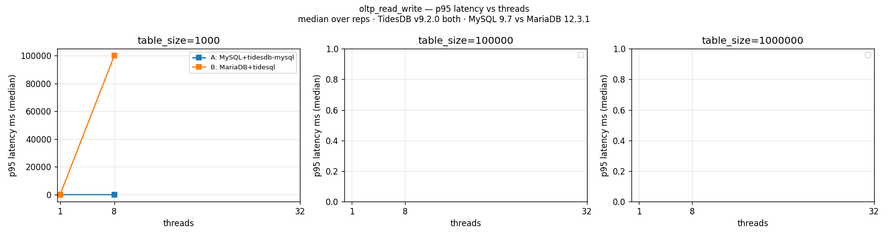

# A-vs-B Performance — cells with MariaDB data only

Filtered to (workload,table_size,threads) combinations where **both** SUTs produced data — a true apples-to-apples comparison. `write_only`/`insert` and `read_write` at 100k/1M have no MariaDB counterpart (run stopped at the OCC-collapse / OOM boundary) and are excluded here; full single-SUT data is in the parent `report.md`.

A = MySQL 9.7 + tidesdb-mysql v0.2.1 · B = MariaDB 12.3.1 + upstream tidesql · TidesDB v9.2.0 both · 12 GB/4 CPU · median[min–max] of 5 reps.

## Results

| Workload | tbl_size | Thr | TPS A | TPS B | A/B | p95ms A | p95ms B | cpu_s A | cpu_s B |
|---|---|---|---|---|---|---|---|---|---|
| oltp_point_select | 1000 | 1 | 10462.14 [6921.40-11708.33] | 8360.88 [7992.80-8734.48] | 1.25 | 0.31 [0.27-0.52] | 0.37 [0.35-0.40] | 10.50 [10.39-10.55] | 11.65 [11.54-11.66] |
| oltp_point_select | 1000 | 8 | 29255.42 [27459.89-30923.29] | 20715.15 [20398.71-20932.94] | 1.41 | 0.43 [0.40-0.46] | 0.53 [0.52-0.53] | 60.16 [60.14-60.26] | 60.34 [60.23-60.47] |
| oltp_point_select | 1000 | 32 | 28464.94 [27277.05-29203.17] | 19707.84 [19516.67-20057.27] | 1.44 | 0.99 [0.97-1.08] | 1.47 [1.44-1.50] | 60.61 [60.54-60.75] | 61.12 [61.02-61.18] |
| oltp_point_select | 100000 | 1 | 13958.47 [13501.61-16698.86] | 8264.56 [7754.64-8661.63] | 1.69 | 0.18 [0.12-0.20] | 0.37 [0.35-0.39] | 10.81 [10.73-10.91] | 11.69 [11.67-11.74] |
| oltp_point_select | 100000 | 8 | 30413.19 [20177.44-32679.72] | 19699.56 [19416.76-20448.20] | 1.54 | 0.40 [0.35-0.57] | 0.55 [0.53-0.56] | 60.24 [60.12-60.28] | 60.34 [60.31-60.50] |
| oltp_point_select | 100000 | 32 | 27054.78 [25806.34-28936.03] | 19381.36 [19315.79-19753.78] | 1.40 | 1.16 [1.10-1.42] | 1.52 [1.44-1.52] | 60.67 [60.56-60.73] | 61.21 [60.95-61.29] |
| oltp_point_select | 1000000 | 1 | 14438.41 [14156.91-14892.41] | 7661.60 [6569.13-7934.38] | 1.88 | 0.22 [0.20-0.22] | 0.41 [0.39-0.51] | 11.32 [11.24-11.35] | 11.80 [11.74-11.85] |
| oltp_point_select | 1000000 | 8 | 28063.80 [26828.61-28380.84] | 18882.10 [18733.03-19293.82] | 1.49 | 0.44 [0.43-0.47] | 0.57 [0.56-0.58] | 60.23 [60.21-60.28] | 60.44 [60.25-60.45] |
| oltp_point_select | 1000000 | 32 | 22066.48 [21676.88-22371.20] | 18291.85 [18059.45-18309.79] | 1.21 | 1.27 [1.25-1.30] | 1.61 [1.55-1.67] | 60.57 [60.37-60.72] | 61.14 [60.95-61.36] |
| oltp_read_write | 1000 | 1 | 136.41 [82.20-148.21] | 132.41 [80.59-135.46] | 1.03 | 13.46 [10.65-16.41] | 11.04 [10.65-17.01] | 6.41 [5.32-7.10] | 8.71 [6.33-8.84] |
| oltp_read_write | 1000 | 8 | 611.34 [593.99-621.94] | 0.03 [0.02-0.20] | 20378.00 | 36.24 [34.95-36.24] | 100000.00 [50446.94-100000.00] | 60.22 [60.20-60.24] | 5.77 [1.70-9.81] |

## Reading the data

- **point_select (complete A-vs-B):** A is faster at every cell — median **~1.4–1.5×** (range **1.21–1.88×**), with lower p95 throughout. Identical engine ⇒ the gap is the MySQL vs MariaDB server + handler/connection path.
- **read_write ts=1000 t=1 (uncontended):** A ≈ B (1.03×, ~135 tps) — single-threaded write latency is the same, as expected (same engine).
- **read_write ts=1000 t=8 (contended):** A = 611 tps; B = 0.03 tps, p95 ≥ 100 s. The `A/B = 20378` cell is degenerate (B≈0) — read it as **B collapses under TidesDB OCC write contention**, not a 20000× speedup. This is the qualitative write-contention divergence, here shown side-by-side at the one contended cell both reached.

## Graphs (only workloads with MariaDB data)

### oltp_point_select

### oltp_read_write

